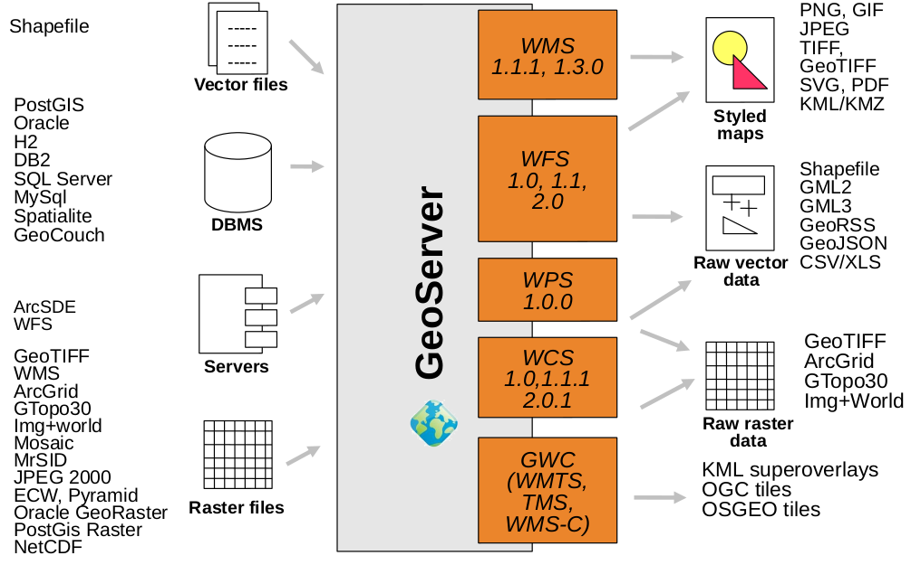

# Datenveröffentlichung

Geodaten können im Raster- und Vektorformat vorliegen. Diese beiden Formate unterscheiden sich
hinsichtlich der Methode, wie räumliche Informationen gespeichert sind. Während Vektordaten die Informationen
mit Hilfe mathematischer Knoten und Pfade, beispielsweise eine Serie von x,y Koordinaten bei Linien, abbildet,
liegen die Informationen beim Rasterformat in Zellen vor. Je nach Maßstab und Anwendungsfall empfiehlt es sich
entweder das ein oder andere Format für die Visualisierung der Geodaten zu verwenden. Die nachfolgende Grafik zeigt
einen Überblick über die möglichen Input und Output Formate von GeoServer.

Im [Folgenden](./vector/index.html) wird zunächst die Veröffentlichung von Layern aus einer Vektordatenquelle erläutert.
