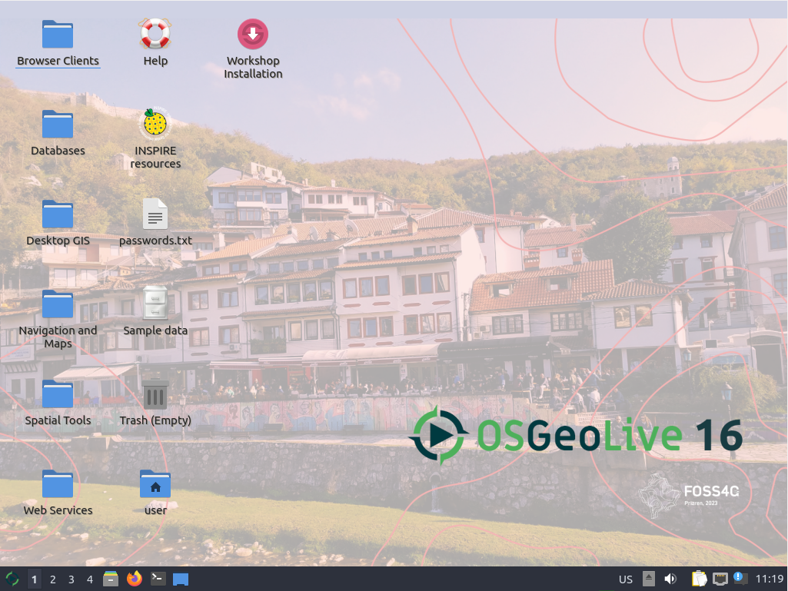

# Vorarbeiten und generelle Informationen

Bevor wir mit dem Workshop starten können, führen Sie bitte die folgenden Schritte
aus:

* Rechner mit OSGeoLive-Medium hochfahren
* Sprache auswählen (Deutsch für korrekte Tastaturbelegung)
* *Lubuntu ohne Installation ausprobieren* auswählen
* Benutzer: `user`; Passwort: `user` (wird vermutlich nicht benötigt)



## Pfade, URLs und Zugangsdaten

* GeoServer: {{ book.geoServerBaseUrl }} (muss zunächst gestartet werden, siehe unten)
* Zugangsdaten GeoServer:
  * Benutzer: <code>{{ book.geoServerUser }}</code>
  * Passwort: <code>{{ book.geoServerPassword }}</code>
* GeoServer (Dateisystem): <code>{{ book.geoServerPhysicalPath }}</code>

# Starten des GeoServers

Der GeoServer kann durch einen Doppelklick auf **Start GeoServer** im Ordner
**Web Services** auf dem Desktop der OSGeoLive gestartet werden:

> **INFO**
>
> Kann der GeoServer **nicht** über den oben genannten Weg gestartet werden oder verhält sich zur Laufzeit unerwartet
> (wenn z.B. das Speichern eines Arbeitsbereichs nicht möglich ist), sollte er stattdessen über den
> folgenden Befehl im Terminal gestartet werden:
> ```
> sudo /usr/local/lib/geoserver/bin/startup.sh
> ```
> Das Terminal bzw. der Prozess muss dabei während des Workshops geöffnet bleiben!


Im [folgenden Abschnitt](../basics/README.md) werden wir mit GeoServer-Basiswissen fortfahren.
