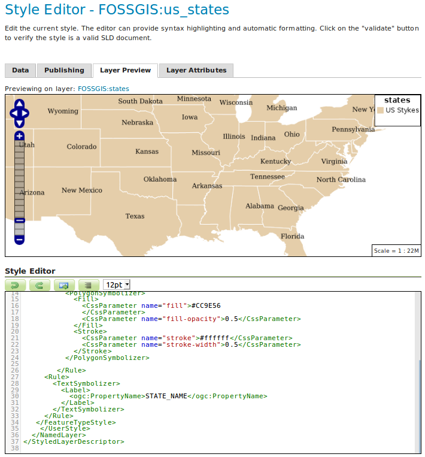

# Styling

## Einführung in SLD

In den vorangehenden Kapiteln wurde bereits deutlich, dass den Geodaten eigene Stile hinzugefügt werden können.
Hierzu bietet GeoServer verschiedene Style-Formate an: *SLD, CSS, YSLD und MBStyle*.
SLD steht für Styled Layer Descriptor und ist ein OGC-Standard. Versuchen Sie die folgenden Aufgaben mit Hilfe
des [GeoServer User Manuals](https://docs.geoserver.org/stable/en/user/styling/sld/index.html) zu lösen.

**Aufgaben:**

1. Definieren Sie für den States Layer (siehe Aufgabe Vector -> Shape) einen
eigenen Stil, der:
  * Alle Flächen in einer Farbe Ihrer Wahl (und mit einer Transparenz von 50%) darstellt.
  * Alle Umrandungen in einer Farbe Ihrer Wahl darstellt.
  * Alle Flächen mit dem Namen des Bundesstaats darstellt.

2. Passen Sie den Beschriftungsstil so an, dass die Beschriftung erst ab einem Maßstab von > 10.000.000 gezeichnet wird.

3. Bonus: Lassen Sie alle Staaten in Abhängigkeit ihrer Bevölkerungsanzahl einfärben. Wählen Sie hierfür eigene Klassengrenzen.

Lösungen:
  * [Aufgabe 1](https://terrestris.github.io/geoserver-introduction-ws/de/assets/style-example-1.sld)
  * [Aufgabe 2](https://terrestris.github.io/geoserver-introduction-ws/de/assets/style-example-2.sld)
  * [Aufgabe 3 (Möglichkeit A)](https://terrestris.github.io/geoserver-introduction-ws/de/assets/style-example-3a.sld)
  * [Aufgabe 3 (Möglichkeit B)](https://terrestris.github.io/geoserver-introduction-ws/de/assets/style-example-3b.sld)
