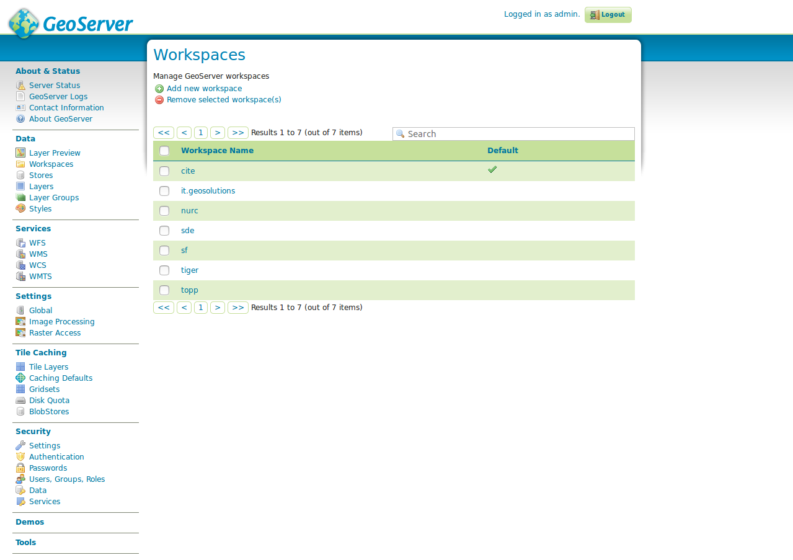

### Daten

Die folgenden Abschnitte beschreiben den umfangreichsten Konfigurationsbereich
des GeoServers, die Schritte zur Veröffentlichung eines Dienstes.

#### Layervorschau


Die **Layer-Vorschau** bietet eine Übersicht aller über diesen GeoServer veröffentlichten
Layer. Damit ein Layer in dieser Übersicht erscheint (und auch im GetCapabilities
Dokument der Instanz erscheint), muss der Layer als `Veröffentlicht` gekennzeichnet sein.
Jeder Layer verfügt über eine Angabe des Typs (s. nachfolgende Tabelle), einen internen Layernamen
(inklusive Name des Arbeitsbereichs), einen Layertitel (Kurzbeschreibung) und eine
Auswahlbox von möglichen Vorschauformaten.

| Typ | Beschreibung |
|:---:|--------------|
|  | Vektorlayer (Typ unbekannt) |
|  | Vektorlayer ((Multi-)Punkt) |
|  | Vektorlayer ((Multi-)Linie) |
|  | Vektorlayer ((Multi-)Polygon) |
|  | Rasterlayer |
|  | Gruppenlayer |
|  | Kaskadierter WMS |

Die Layerliste kann per Linksklick auf die Spaltennamen `Typ`, `Name`
oder `Titel` auf- und absteigend sortiert werden. Neben einer Übersicht aller
verfügbaren Layer, kann eine Vorschau eines Layers in verschiedenen Formaten
vorgenommen werden. Dies empfiehlt sich insbesondere für eine schnelle und
komfortable Überprüfung eines neu angelegten Layers. Der schnellste Weg zu einer
Vorschau ist das „Format“ OpenLayers, wodurch ein neues Fenster mit einer
Vorschaukarte des ausgewählten Layers geöffnet wird.


Die OpenLayers Map erlaubt eine freie Navigation innerhalb des Layers und eine
GetFeatureInfo-Abfrage durch einen Linksklick in den Layer. Über den Button
**toggle options toolbar** oberhalb des Navigationskreuzes kann eine
Werkzeugleiste eingeblendet werden, die Optionen zur Manipulation des GetMap-Aufrufs
ermöglicht (Bildformat und -größe, Antialiasing etc.).
Unter der Auswahlbox **Alle Formate** sind weitere Formate aufgelistet, die nach WMS
und WFS gegliedert sind. Für die Vorschau eines WMS wird dabei jedoch das obige
Format „OpenLayers“, für die Vorschau eines WFS das Format „GML2“ empfohlen.
**Hinweis:** Über die Auswahlbox ist auch der Export als Shapefile möglich, das
in jedes gängige Desktop GIS zur Weiterverarbeitung eingebunden werden kann.

**Aufgabe:**

1. Rufen Sie die OpenLayers Layervorschau eines beliebigen Layers auf (sofern vorhanden) und ändern Sie die
Requestparamter `Tiling` und `Format` zu einem Parameter Ihrer Wahl. Rufen Sie anschließend
die GetFeatureInfo ab.

#### Arbeitsbereiche

Über den Menüeintrag **Arbeitsbereiche** kann die Übersicht aller verfügbaren Arbeitsbereiche
des GeoServers aufgerufen werden. Über die GUI können neue Arbeitsbereiche erstellt oder
bestehende editiert werden.



Der GeoServer legt Layer über folgende Hierarchie ab:

```
Arbeitsbereich
 └ Datenspeicher
  └ Layer
 └ Gruppenlayer
 └ Stile
```

Zentrales Element ist der sog. Arbeitsbereich, der zunächst als Sammelobjekt für
Layer verstanden werden kann. Analog zu einem Namensbereich organisiert der
Arbeitsbereich Objekte eines gemeinsamen Themas, z.B. die Layer einer bestimmten
Abteilung oder eines bestimmten Themas.
Jedem Arbeitsbereich können nun weitere Konfigurationselemente zugeordnet werden.
Hierzu zählen u.a. der Datenspeicher, die (Gruppen-) Layer, Stile und übergeordnete
Einstellungen des GeoServers wie Kontaktdaten oder globale WMS-Einstellungen.
**Wichtig:** Wird ein GeoServer initial in Betrieb genommen, muss die oben
skizzierte Reihenfolge beim Anlegen eines Layers genauestens beachtet werden, d.h. zunächst
wird ein Arbeitsbereich, danach ein Datenspeicher und anschließend ein Layer
(inklusive Stil) angelegt.

**Hinweis:** Der GeoServer besitzt im Auslieferungszustand mehrere Beispiel-Arbeitsbereiche
(*cite, it.geosolutions, nurc, sde, sf, tiger, topp*). Diese können im
Produktivbetrieb ohne Bedenken gelöscht werden.

**Aufgabe:**

1. Legen Sie einen neuen Arbeitsbereich mit dem Namen `FOSSGIS` an. Als Namespace URI geben Sie
`http://geoserver.org/fossgis`ein. Markieren Sie diesen Arbeitsbereich als Standardarbeitsbereich.

#### Datenspeicher


Der **Datenspeicher** ist eine Referenz zu einer Datenquelle, die Vektor- oder Rasterdaten
zur Veröffentlichung enthält. Jeder Datenspeicher wird dabei genau einem Arbeitsbereich
zugeordnet. Ein Datenspeicher beinhaltet dabei z.B. Verbindungsparameter
zu einer Datenbank oder den Pfad zu einem Shapefile.
Die obige Abbildung zeigt die Übersicht aller verfügbaren Datenspeicher, die über
das Feld Datenspeicher im linken Navigationsmenü aufgerufen werden kann. Die
Übersicht besteht aus den Spalten *Datentyp, Arbeitsbereich, Name für Datenspeicher,
Typ* und *Aktiv*. Der Datentyp beschreibt den Typ des Datenspeichers, wobei es sich
um einen der in nachfolgenden Tabelle aufgelisteten Datentypen handeln kann. Arbeitsbereich
beinhaltet den übergeordneten Namen des Arbeitsbereichs, Name für Datenspeicher den
Namen des Datenspeichers, Typ den konkreten Speichertyp (z.B. die Datenbank) und
Aktiv den Status des Datenspeichers.

| Typ | Beschreibung |
|:---:|--------------|
|  | Einzeldatei/Verzeichnis (Vektordaten) |
|  | Einzeldatei/Verzeichnis (Rasterdaten) |
|  | Datenbank (Vektordaten) |
|  | WMS |
|  | WFS |

Über das Formular kann sowohl einer neuer Datenspeicher angelegt werden als auch
ein bestehender Datenspeicher editiert werden.

#### Layer


Layer sind die Repräsentationen von Geodaten (Vektor- oder Raster). Jeder Layer
enthält dabei mehrere Kartenelemente (Features), die als gerenderte Rasterdaten
(WMS) oder als Rohdaten (WFS bzw. WCS) abgerufen werden können. Jedem Layer ist im GeoServer
gemein, dass sie genau einem Arbeitsbereich und genau einem Datenspeicher zugehörig
sind.
**Wichtiger Hinweis:** Der GeoServer legt automatisch für jeden Layer einen
WMS und WFS an, ein getrenntes Anlegen ist nicht möglich. Es ist ausschließlich
möglich im Arbeitsbereich zu definieren, ob alle Layer in diesem Arbeitsbereich
sowohl per WMS als auch per WFS, nur als WMS oder nur als WFS abfragbar sind.

Die Übersicht besitzt Spalten zur Angabe des jeweiligen Typs, dem Namen des
Arbeitsbereichs, Datenspeichers sowie des Layers (Name), Status (Aktiv) und
Koordinatenreferenzsystem im EPSG Code. Wie bei den anderen Listentypen auch,
kann die Liste nach den entsprechenden Spalten durch einen Linksklick auf den
Spaltentitel auf-  und abwärts sortiert werden. Über die Liste ist ebenfalls ein
direkter Aufruf der Parameter des Arbeitsbereichs sowie des Datenspeichers
durch einen Linksklick auf die entsprechenden Titel möglich.

#### <a name="group-layer"></a>Gruppenlayer


Gruppenlayer sind eine Sammlung von bereits im GeoServer veröffentlichten Layern,
die gemeinsam über nur einen Layer angefordert werden.

Für das Anlegen eines Gruppenlayers über das Formular **Gruppenlayer hinzufügen** sind mindestens
die folgenden Einstellungen notwendig:

* `Name`: Name des Layers.
* `Titel`: Titel des Layers.
* `Arbeitsbereich`: Der Name des Arbeitsbereichs, in dem der Gruppenlayer angelegt
  werden soll.
* `Ausdehnung`: Die vier Felder (Min X, Min Y, Max X, Max Y) beinhalten die BoundingBox
  der Daten dieses Gruppenlayers im nativen Koordinatenreferenzsystem. Die Eingabe
  kann manuell oder automatisch über **Ausdehnung generieren** (empfohlen) erfolgen.
  **Wichtig:** Ohne Angabe einer BoundingBox kann der Layer nicht erfolgreich angelegt
  werden und die Werte sollten immer den kompletten Datenbestand beinhalten, da
  diese über den GetCapabilities-Request abgefragt und beim Einladen eines WMS
  (z.B. mit QGIS) relevant für den initialen Kartenausschnitt sind.
* `Koordinatenreferenzsystem`: Koordinatenreferenzsystem im EPSG-Code.
* `Layer`: Über den Button **Layer hinzufügen** oder **Layergruppe hinzufügen** können dem
  Gruppenlayer einzelne Layer oder andere Gruppenlayer hinzugefügt werden.
  Durch einen Klick auf den entsprechenden Button öffnet sich das Fenster Layer
  auswählen, in dem alle verfügbaren Layer der GeoServer Instanz erscheinen.
  Aus dem Fenster kann ein Layer durch einen Klick auf den Layernamen ausgewählt
  und an den Gruppenlayer übergeben werden. Jeder ausgewählte Layer erscheint
  anschließend in der Tabelle unterhalb des Formularelements Layer.

In der Übersichtstabelle kann die Zeichenreihenfolge der Layer durch die Pfeilsymbole angegeben
werden, wobei der oberste Layer als unterster Layer in diesem Gruppenlayer gezeichnet
wird. Weiter kann dem Layer ein Stil abweichend vom Layer zugewiesen oder der
Layer aus der Gruppe entfernt werden.

#### Layerstile


Die Zeichenvorschrift bestimmt das Aussehen eines Layers in Abhängigkeit von
Attributeigenschaften. Im GeoServer wird die Symbologie eines Layers über ein SLD
(Styles Layer Descriptor, ein XML-Dialekt) angeben, welches im Dialog Stile
erstellt bzw. geändert werden kann.

Die Liste enthält alle verfügbaren Stile dieses GeoServers und erlaubt entweder
das Erstellen eines neuen Stils durch den Button Hinzufügen eines neuen Stils,
das Entfernen eines bestehenden Stils (Auswahl des Stils über die Checkbox und
Klick auf Ausgewählte Stile löschen) oder das Ändern eines bestehenden Stils
durch einen Klick auf den Stilnamen.

Wird ein neuer Stil erstellt oder ein bestehender Stil editiert, öffnet sich das
Formular Neuer Stil bzw. Stil Editor. Das Formular bietet folgende Optionen:

* `Name`: Name des Stils. Ist der Stil genau von einem Layer in Verwendung, sollte der
  Name dies widerspiegeln (gleicher Name wieder Layer o.ä.).
* `Arbeitsbereich`: Arbeitsbereich dieses Stils.
* `Von einem vorhandenen Stil kopieren`: Sind Elemente des neuen Stils bereits in
  einem bestehende Stil vorhanden, kann ein vorhandener Stil als Vorlage für den
  neuen Stil ausgewählt werden.
* `SLD Eingabefeld`: Im Eingabefeld erfolgt die Eingabe des Layerstils. Eine vollständige
  Erläuterung der SLD-Syntax würde den Rahmen dieses Workshops sprengen, daher wird
  an dieser Stelle auf die GeoServer Dokumentation, gegliedert nach Einsatzzwecken, verwiesen:
    * Inhaltsverzeichnis: https://docs.geoserver.org/stable/en/user/styling/index.html
    * Punktstile: https://docs.geoserver.org/stable/en/user/styling/sld/cookbook/points.html
    * Linienstile: https://docs.geoserver.org/stable/en/user/styling/sld/cookbook/lines.html
    * Polygonstile: https://docs.geoserver.org/stable/en/user/styling/sld/cookbook/polygons.html
* `Datei auswählen`: Wurde das SLD in einem externen Editor erstellt, kann diese Datei
   direkt in das Formular geladen werden.

Wichtiger Hinweis: Bevor der Stil über Speichern gespeichert wird, sollte dieser über
Validieren auf Korrektheit geprüft werden. Liegt ein Fehler (z.B. in der Syntax)
vor, erscheint am oberen Rand des Formulars ein Fehler mit einem Hinweis auf die
Fehlerursache.
