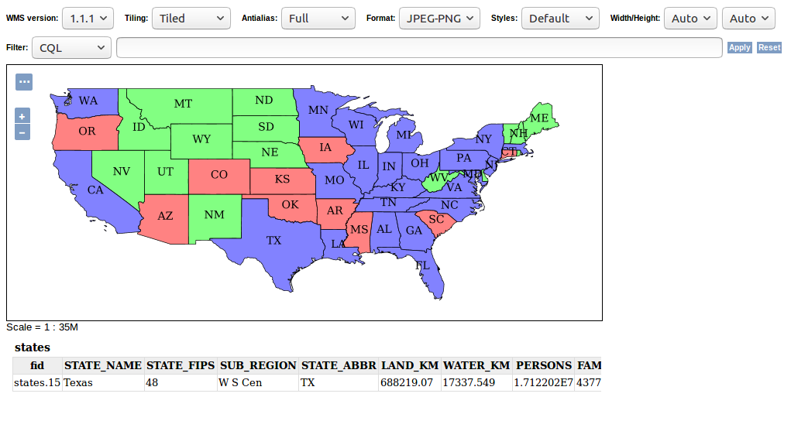
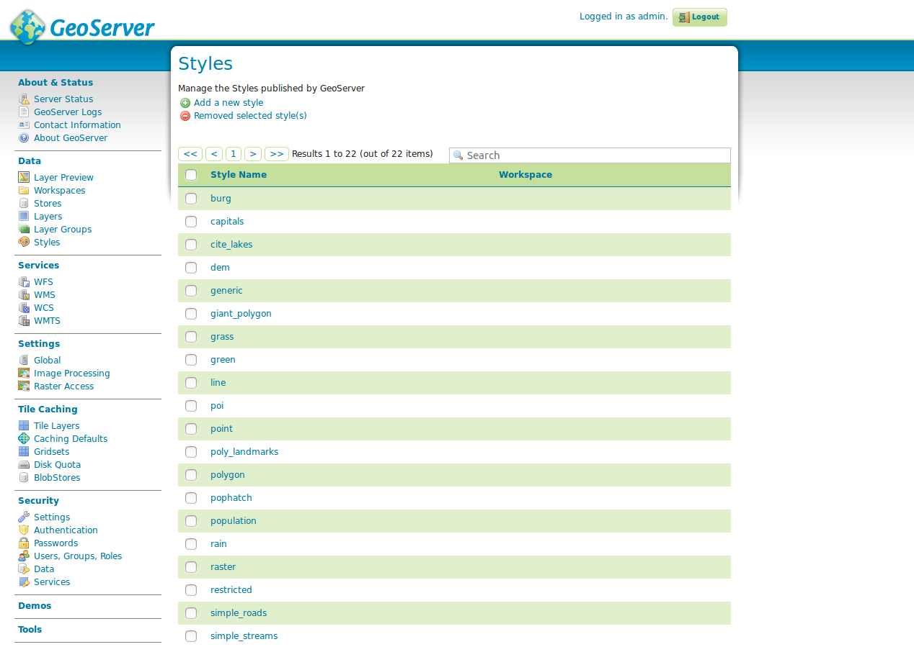

### Data

The following sections describe the most comprehensive configuration area of GeoServer, the steps for publishing a service.

#### Layer preview


The **layer preview** provides an overview of all layers published on this GeoServer. For a layer to appear in this overview (and also in the GetCapabilities document of the instance), it must be marked as `prefigured`.
Each layer has a specification of the type (see table below), a internal layer name
(including name of the work space), a layer title (short description) and a selection box of possible preview formats.

<!--englische begriffe-->

| type | description |
|:---:|--------------|
|  | vector layer (type unknown) |
|  | vector layer ((Multi-)Point) |
|  | vector layer ((Multi-)Line) |
|  | vector layer ((Multi-)Polygon) |
|  | raster layer |
|  | layer group |
|  | cascaded WMS |

The layer list can be sorted ascending and descending by left-clicking on the column names `type`, `name`
or `title`. In addition to an overview of all available layers, a preview of a layer can be displayed in various formats. This is recommended in particular for a quick and easy comfortable checking of a new created layer. The fastest way to get a preview is to use the "Format" OpenLayers, which creates a new window with a preview map of the selected layer.



The OpenLayers map allows a free navigation within the layer and a GetFeatureInfo query by a left click inside the layer.
The button **toggle options toolbar** above the navigation allows you to display a toolbar with the options to manipulate the GetMap call (format and size, Antialiasing etc.).
Further formats are listed below the selection box **All formats**. They are structured according to WMS and WFS. For the preview of a WMS „OpenLayers“ is recommended, while for a preview of a WFS you should choose the "GML2" format.
**Hint:** Via the selection box the export as Shapefile is also possible. Shapefiles can be integrated into any standard desktop GIS for further processing.

**Task:**

1. Call up the OpenLayers layer preview of any layer and change the parameters `Tiling` und `Format` to a parameter of your choice. Afterwards call GetFeatureInfo.

#### Workspaces

The menu item **Workspaces** provides an overview of all available workspaces of GeoServer. The GUI can be used to create new workspaces or to edit
existing ones.


The GeoServer stores layers using the following hierarchy:

```
Workspace
 └ store
  └ Layer
 └ Layer(groups)
 └ Style
```

The central element is the so-called workspace, which can initially be understood as a collection object for layers. Similar to a namespace, the workspace organizes objects of a common theme, e.g. the layers of a specific department or topic.
Further configuration elements can now be assigned to each workspace.
This includes among others the store, the layer (-group), styles and higher-level settings
of GeoServer like contact information or global WMS-settings.
**Important:** If a GeoServer is initially put into operation, the sequence outlined above must be strictly adhered when creating a layer, that means, first a workspace is created, then a store and then a layer (with styles).

**Hint:** The GeoServer has several example workspaces in the delivery state
(*cite, it.geosolutions, nurc, sde, sf, tiger, topp*). These can be deleted without hesitation in productive operation.

**Task:**

1. Create a new workspace with the name `FOSSGIS`. For Namespace URI set
`http://geoserver.org/fossgis`. Select this workspace as the default workspace.

#### store


The **(data) store** is a reference to a data source, which contains vector or raster data for publication. Each store is assigned to exactly one workspace. A store includes connection parameters to a database or the path to a shapefile for example.
The figure above shows an overview of all available stores, which can be accessed via the store field in the left-hand navigation menu. The overview contains the columns *data type, workspace, store name,
type* and *enabled*. The *data type* describes the type of the store, which can be one of the data types listed in the following table. *Workspace* contains the superior name of the workspace, *store name* the name of the store, *type* the concrete storage type (for example, the database) and
*enabled* the status of the store.

| type | description |
|:---:|--------------|
|  | single file/directory (vector data) |
|  | single file/directory (raster data) |
|  | database (vector data) |
|  | WMS |
|  | WFS |

The form can be either used to create a new store or to edit an existing one.

#### Layers


Layers are the representations of geodata (vector or raster). Each layer contains several map elements (Features), which can be retrieved as rendered raster data (WMS) or as raw data (WFS or WCS). Each layer in GeoServer has in common that it has exactly one workspace and exactly one store. 
**Important Hint:** GeoServer automatically creates a WMS and WFS for each layer, a seperate creation is not possible. You can only define in the workspace, if all layers in the current workspace can be received as WMS and WFS, only as WMS or only as WFS.

The overview has columns for specifying the respective type, name of the workspace, store and the layer's name, status and the
coordinate reference system as EPSG Code. Like all types of lists, you can sort the list ascending and descending by the corresponding columns by left-clicking each columns title. You can also call the parameters of the workspace and of the store directly from the list by left-clicking the corresponding title.

#### <a name="group-layer"></a>Layer groups


Layer groups are a collection of layers already published in the GeoServer,
which are requested together via only one layer.

For creating a layer group using the form. **Add new layer group** at least the following settings are necessary:

* `Name`: Name of the layer.
* `Title`: Title of the layer.
* `Workspace`: The name of the workspace in which the group layer should be created.
* `BoundingBox`: The four fields (Min X, Min Y, Max X, Max Y) contain the BoundingBox of the data of this layer group in the native coordinate reference system. The input can be done manually or automatically with the help of **Generate Bounds** (recommended).
  **Important:** Without a BoundingBox the layer cannot be created successfully. The values should always contain the complete dataset, because these are queried using the GetCapabilities request when loading a WMS 
  (e.g. in QGIS). There it is relevant for the initial map section.
* `Coordinate Reference System`: Coordinate Reference System as EPSG-Code.
* `Layer`: The buttons **Add Layer** or **Add Layer Group** can be used to add individual  layers or other grouped layers to the layer group.
  A click on the corresponding button opens the *Select Layer* window, in which all available layers of the GeoServer instance appear.
  A layer can be selected from the window by clicking on the layer's name and is then passed to the layer group. Each selected layer then appears in the table below the layer form element.

In the overview table the order of the layers can be determined by the arrow symbols, where the uppermost layer is drawn as the lowest layer in this layer group. You can also assign a different style to the layer or remove the layer from the group.

#### Layer style



The drawing rule determines the appearance of a layer depending on attribute properties. GeoServer displays the symbology of a layer with the help of SLD
(Styled Layer Descriptor, a XML based dialect), which can be created or changed in the styles dialog.

The list contains all available styles of this GeoServer and allows you to either create a new style by clicking the *Add new Style* button,
delete an existing style (Select the style using the checkbox and click *Delete selected styles*) or changing an existing style by clicking on the style's name.

When creating a new style or editing an existing style, the form *New style* respective *Style Editor*. The form offers the following options:

* `Name`: Name of the style. If the style is used by exactly one layer, the style's name should reflect this (e.g. same name as layer).
* `Workspace`: Workspace of the style.
* `Copy from an existing style`: If elements of the styles are used by other styles, an existing style can be chosen as a template.
* `SLD input field`: The layer style is entered in the input field. A full explanation of the SLD syntax would go beyond the scope of this workshop, 
  therefore the GeoServer documentation will be referred to here, structured according to purposes:
    * Table of contents: https://docs.geoserver.org/stable/en/user/styling/sld/index.html
    * points: https://docs.geoserver.org/stable/en/user/styling/sld/cookbook/points.html
    * lines: htthttps://docs.geoserver.org/stable/en/user/styling/sld/cookbook/lines.html
    * polygons: https://docs.geoserver.org/stable/en/user/styling/sld/cookbook/polygons.html

* `Select file`: If the SLD was created in an external editor, this file can be loaded directly into the form.

**Important hint**: Before the style is saved via *Save*, it should be checked for correctness via *Validate*. If there is an error (e.g. syntax error), an error appears at the top of the form with a hint to the cause of the error.
